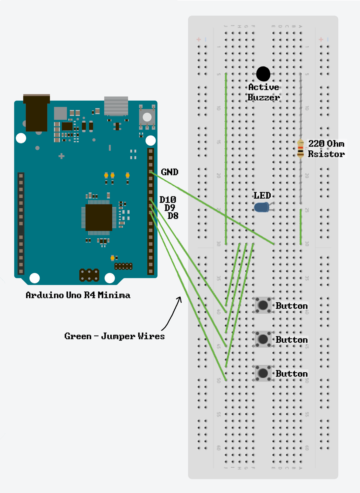

# arduino-projects
collection of random projects i made using arduino every folder equals one of the projects i made below is more info on every project included in here: 

blink_fast

what it does: it blinks the built-in led 20 times a second making it blink fast so ye  
what you need: 1 arduino uno r4 minima, and some way to connect it to your computer  
instructions: open blink_fast.ino with the arduino ide and upload it into your arduino uno 

blink_led_fast

what it does: depending on how fast you want it, it blinks an led and it makes ringing sound  
what you need: 9 jumper wires, 3 buttons, 1 led, 1 220-ohm resistor, 1 active buzzer, 1 breadboard, 1 arduino uno r4 minima, and some way to connect it to your computer  
instructions: connect all of the wires and stuff into your breadboard & arduino in the way shown:    then, open blink_led_fast.ino with the arduino ide and upload it into your arduino uno the bottom-most button activates it as long as you hold it, the button above it turns it off and on about 2 times a second, and the top-most button turns it off and on about 10 times a second. 

